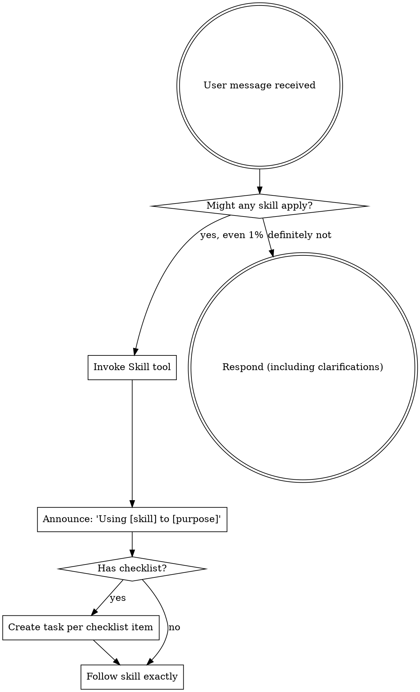

## Copilot Compatibility Notes

- `Skill(skill="groundwork:<name>")` should be interpreted as using the corresponding `/<name>` skill.
- `Task(...)` references should be handled with Copilot custom agents (`/agent`) or delegated workflows.
- `AskUserQuestion` references should be handled by asking the user directly and waiting for input.
- `Plan`/`ExitPlanMode` references map to Copilot plan mode toggling.

<EXTREMELY-IMPORTANT>
If you think there is even a 1% chance a skill might apply to what you are doing, you ABSOLUTELY MUST invoke the skill.

IF A SKILL APPLIES TO YOUR TASK, YOU DO NOT HAVE A CHOICE. YOU MUST USE IT.

This is not negotiable. This is not optional. You cannot rationalize your way out of this.
</EXTREMELY-IMPORTANT>

## How to Access Skills

**In Claude Code:** Use the `Skill` tool. When you invoke a skill, its content is loaded and presented to you—follow it directly. Never use the Read tool on skill files.

**In other environments:** Check your platform's documentation for how skills are loaded.

# Using Skills

## The Rule

**Invoke relevant or requested skills BEFORE any response or action.** Even a 1% chance a skill might apply means that you should invoke the skill to check. If an invoked skill turns out to be wrong for the situation, you don't need to use it.

## Red Flags

These thoughts mean STOP—you're rationalizing:

| Thought | Reality |
|---------|---------|
| "This is just a simple question" | Questions are tasks. Check for skills. |
| "I need more context first" | Skill check comes BEFORE clarifying questions. |
| "Let me explore the codebase first" | Skills tell you HOW to explore. Check first. |
| "I can check git/files quickly" | Files lack conversation context. Check for skills. |
| "Let me gather information first" | Skills tell you HOW to gather information. |
| "This doesn't need a formal skill" | If a skill exists, use it. |
| "I remember this skill" | Skills evolve. Read current version. |
| "This doesn't count as a task" | Action = task. Check for skills. |
| "The skill is overkill" | Simple things become complex. Use it. |
| "I'll just do this one thing first" | Check BEFORE doing anything. |
| "This feels productive" | Undisciplined action wastes time. Skills prevent this. |
| "I know what that means" | Knowing the concept ≠ using the skill. Invoke it. |
| "I'll just start working on the task" | Task execution REQUIRES the execute-task skill. Invoke it first. |
| "Let me implement this task" | Always invoke execute-task skill - it handles worktree isolation. |

## Skill Priority

When multiple skills could apply, use this order:

1. **Process skills first** (product-design, architecture) - these determine HOW to approach the task
2. **Implementation skills second** (tasks, test-driven-development) - these guide execution

"Let's build X" -> product-design first, then implementation skills.

## Skill Types

**Rigid**: follow exactly, don't adapt away discipline

**Flexible**: adapt principles to context.

The skill itself tells you which type it is.

## User Instructions

Instructions say WHAT, not HOW. "Add X" or "Fix Y" doesn't mean skip workflows.
